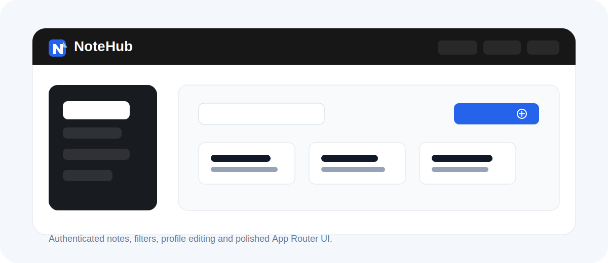

<p align="center">
  
</p>

<h1 align="center">NoteHub</h1>

<p align="center">
  A polished notes manager built with Next.js App Router, authentication, filtering, pagination, modal note previews, and profile editing.
</p>

<p align="center">
  
  
  
  
</p>



## Overview

NoteHub is a small but complete authenticated notes application. It connects to the public NoteHub API through local Next.js API routes, keeps server and client data in sync with TanStack Query, and uses the App Router for server rendering, protected routes, parallel routes, and modal previews.

The UI has been tuned beyond the default starter look: responsive cards, sidebar filtering, clean form surfaces, custom favicon, profile screens, `react-select` tag picking, and subtle hover/focus states across the app.

## Features

- Authentication: sign up, sign in, logout, and session refresh.
- Notes dashboard with search, tag filters, pagination, creation, details, and deletion.
- Intercepting modal route for note previews over the notes list.
- Dedicated note details page with formatted dates.
- Profile and edit profile screens.
- Local avatar upload from the user's computer, compressed in the browser and stored per account in `localStorage`.
- Responsive layout for desktop and mobile.
- Metadata and Open Graph setup for pages.
- SVG favicon: blue note with a white `N`.

## Tech Stack

| Area | Tools |
| --- | --- |
| Framework | Next.js 16 App Router |
| UI | React 19, CSS Modules, modern-normalize |
| Language | TypeScript |
| Server state | TanStack Query |
| Client state | Zustand |
| HTTP | Axios |
| Forms and UI helpers | react-select, react-paginate, use-debounce |
| API | [NoteHub API](https://notehub-api.goit.study/docs/) |

## Getting Started

### 1. Install dependencies

```bash
npm install
```

### 2. Create environment file

Create `.env` in the project root:

```env
NEXT_PUBLIC_API_URL=http://localhost:3000
```

The browser talks to local Next.js API routes under `/api`, and those routes forward requests to:

```txt
https://notehub-api.goit.study
```

### 3. Start development server

```bash
npm run dev
```

Open:

```txt
http://localhost:3000
```

## Scripts

```bash
npm run dev
npm run build
npm run start
npm run lint
```

## App Routes

| Route | Purpose |
| --- | --- |
| `/` | Home page |
| `/sign-in` | Login page |
| `/sign-up` | Registration page |
| `/notes/filter/all` | Notes dashboard |
| `/notes/filter/[tag]` | Notes filtered by tag |
| `/notes/action/create` | Create note page |
| `/notes/[id]` | Full note details page |
| `/(.)notes/[id]` | Modal note preview route |
| `/profile` | User profile |
| `/profile/edit` | Edit username and local avatar |

## Project Structure

```txt
app/
  (auth routes)/       Authentication pages
  (private routes)/    Notes and profile pages
  @modal/              Intercepting modal route for note preview
  api/                 Local proxy routes to NoteHub API
components/            Reusable UI components
lib/
  api/                 Client/server API wrappers
  store/               Zustand stores
  utils/               Shared helpers
types/                 Shared TypeScript types
docs/                  README artwork
```

## Avatar Note

The public NoteHub API accepts profile updates for username, but it does not persist uploaded avatar files through `PATCH /users/me`. To keep the UI useful, avatar upload is handled locally:

- user selects an image from their computer;
- the app validates type and size;
- the image is cropped and compressed to WebP in the browser;
- the result is stored in `localStorage` by user email.

This means the avatar is available in the same browser, but it is not synchronized across devices.

## API Proxy

The app uses local API routes to keep cookies and credentials flowing correctly:

- `app/api/auth/*`
- `app/api/notes/*`
- `app/api/users/me`

Client-side API calls use:

```ts
const baseURL = `${process.env.NEXT_PUBLIC_API_URL}/api`;
```

Server-side route handlers forward to:

```ts
https://notehub-api.goit.study
```

## Quality Checks

The current project passes:

```bash
npm run lint
npm run build
```

## Visual Identity

The favicon lives in:

```txt
app/icon.svg
```

It uses a compact blue note mark with a white `N`, designed to stay readable at browser-tab size.
